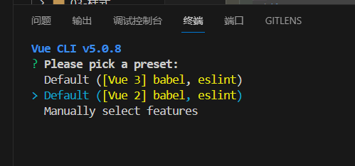
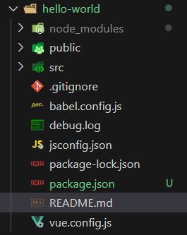

~~~tex
https://cli.vuejs.org/zh/guide/installation.html		VUE2官网
npm install -g @vue/cli
vue --version		查看版本号

vue create hello-world(项目名)(进入想创建的地方，别在全局输命令)		创建一个项目
选择项目版本vue2（vue3、vue2、手动选择）（1）

文件介绍:
.gitigonre			git忽略文件
bable				  	es6转成es5语法文件
package.json	
~~~

(1)

(2)

~~~tex
npm run serve		启动项目

~~~

