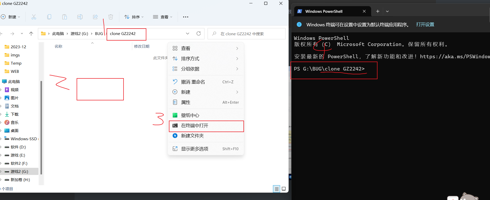
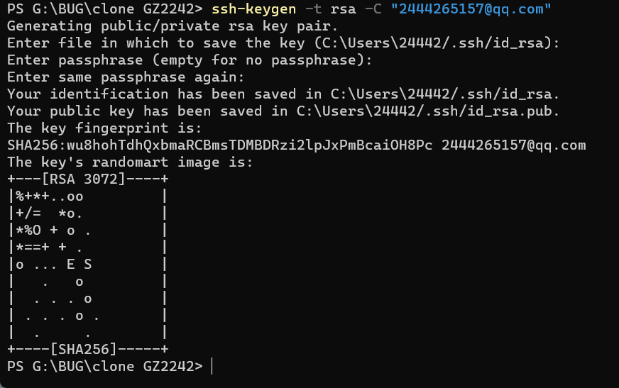
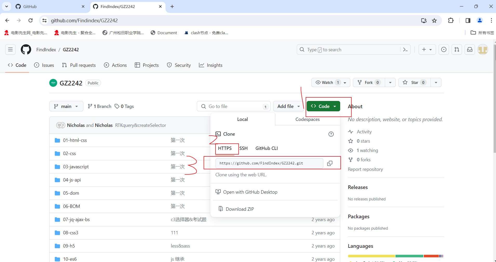
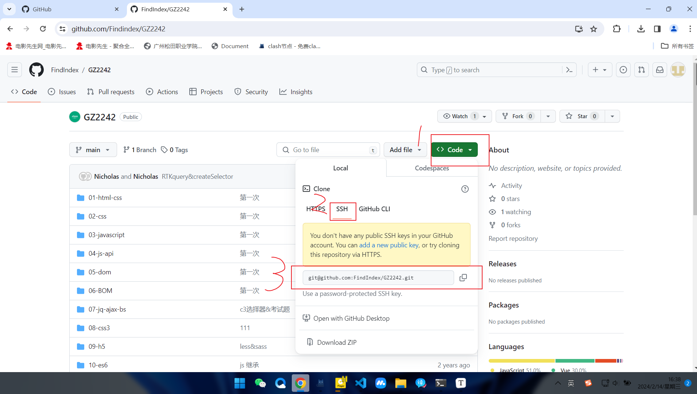
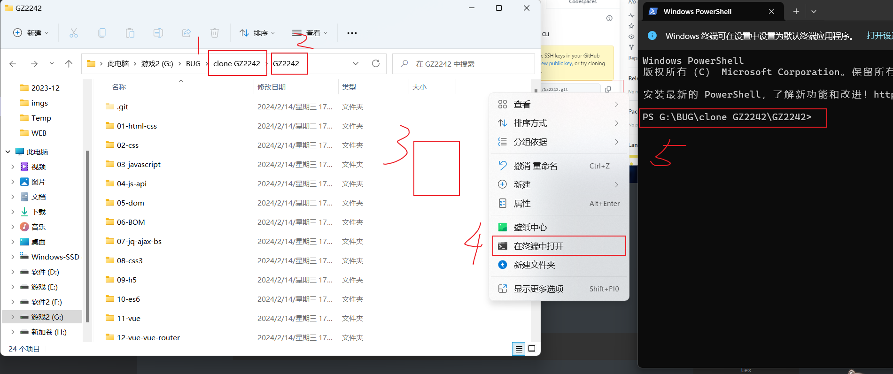

# 3.克隆仓库内容

```tex
新建一个空白文件夹(全英文)-双击进入-右键-在终端中打开   (1)
(或者右键-显示更多选项-Open Git Bash here)

https://github.com/Findindex/GZ2242

(若是第一次)
输入 ssh-keygen -t (想创建的秘钥名) -C "(自己邮箱)"    (2)
找到code-HTTPS-(git地址(此地址只需用于使用命令克隆一次，之后便可以使用其他命令更新文件))   (3)
输入 git clone https://github.com/FindIndex/GZ2242.git

(若不是第一次)
找到code-SSH-(git地址)    (4)
输入 git clone git@github.com:FindIndex/GZ2242.git
```


(1)




(2)




(3)




(4)




# 4.更新代码

```tex
打开克隆下来的文件夹(拥有.git的文件夹)
右键-在终端打开-确认目录
输入 git pull 即可更新代码(推送人需要输入 git push)
```




