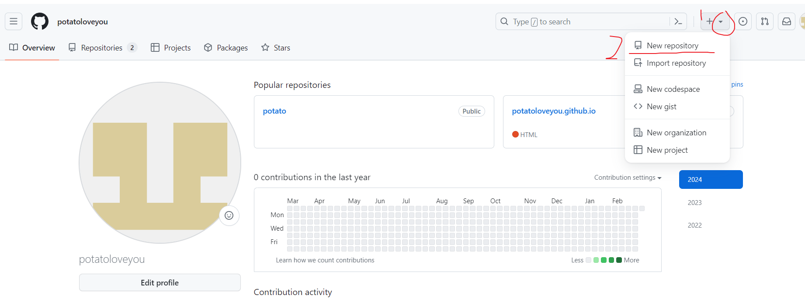

# 1.安装git

```tex
https://git-scm.com/
下载git  Download for Windows
点击Click here to download    ①
安装git(不需要改任何配置,全程默认下一步)
安装完成后，win+r:cmd,输入git -v    ②
```

①


②


# 2.gitHub创建仓库

```tex
进入自己主页面   (1)
点击New repository    (2)
设置好名字后点击创建，即可跳转到下个页面    (3)
新页面打开自己的面板，点击settings   (4)
找到SSH and GPG - connecting to GitHub using SSH keys   (5)
依次找到命令    (6)
cmd输入 ssh-keygen -t (想创建的秘钥名) -C "(自己邮箱)"
打开c盘-用户-24442-.ssh，即可看到两个文件(私钥和公钥(.pub))    (7)
笔记本打开公钥，复制公钥    (8)
回到gitHub-(第五步(5))-New SSH key   (9)
设置名字-粘贴公钥-Add SSH key   (10)
创建好后即可出现    (11)
回到创建好的仓库(第三步(3))-找到三条命令依次在vscode创建好仓库的文件夹下输入(前提是有输入用户名和邮箱(git命令第三条))    (12)
```


(1)


(2)



(3)


(4)


(5)


(6)


(7)


(8)


(9)


(10)


(11)


(12)


