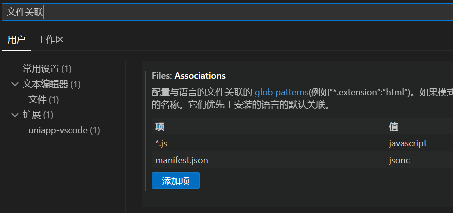

```tex
(1)使用命令行创建 vue3 ts项目 
npx degit dcloudio/uni-preset-vue#vite-ts 项目名称

(2)下载依赖
pnpm i

(3)启动项目，在package.json中找到对应命令		①
pnpm dev:h5
pnpm dev:mp-weixin

(4)微信小程序需要导入项目

(5)安装语法提示插件		②

(6)安装类型声明文件
pnpm i -D @types/wechat-miniprogram @uni-helper/uni-app-types

(7)配置tsconfig.json		③
"types": ["@dcloudio/types", "@types/wechat-miniprogram", "@uni-helper/uni-app-types"]
"vueCompilerOptions": {
	"nativeTags": ["block", "component", "template", "slot"]
},

(8)解决json注释报错问题
设置搜索：文件关联，设置对应文件类型声明		④


(9)安装uni-ui(uniapp扩展组件)
安装 sass、sass-loader
pnpm i sass -D
npm i sass-loader -D
安装uni-ui
npm i @dcloudio/uni-ui

(10)配置pages.json自动导入组件		⑤
	"easycom": {
		"autoscan": true,
		"custom": {
			// uni-ui 规则如下配置
			"^uni-(.*)": "@dcloudio/uni-ui/lib/uni-$1/uni-$1.vue"
		}
	},
```


①


②


③


④



⑤


