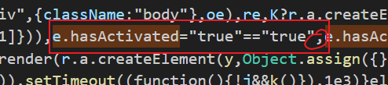

~~~tex
Snipaste
(截图软件)

Typora(永久免费配置)
1.打开安装盘符(默认C盘):\Typora\resources\page-dist\static\js\LicenseIndex.180dd4c7.5c394f9a.chunk.js(此文件可能有两个 都需要改)
2.Ctrl+F查找 e.hasActivated 这个字段
3.e.hasActivated="true"=="true",
(在【e.hasActivated="true"==】后面添加 "true", 即改为上面那段   注意：一定要添加逗号)

Clash For Windows(代理)
https://mao.jncydz.cn/
github搜索clash汉化app.asar文件
(Clash for Windows-resources-app.asar)替换

Postman(接口管理测试工具)
https://www.postman.com/downloads/

vscode插件安装：
live server 
文件-首选项-设置-扩展-Live Server Config-Settings: Custom Browser：chrome
vscode-icons(更改文件图标)
indent-rainbow(彩虹作用域)
image preview(vscode中显示插入的图片)
Auto Rename Tag(自动修改闭合标签)
codegeex(AI)
any-rule(正则) 按F1输入zz
Regex Previewer(测试正则,必须在js文件中才能使用)

Prettier - Code formatter(格式化插件，安装后需要在首选项-设置-搜索:Prettier自行修改配置	或者
文件-首选项-设置-打开设置(json)(右上角左起第一个)-添加:)
1.
  /* prettier的配置 */
  "prettier.printWidth": 120, // 超过最大值换行
  "prettier.tabWidth": 2, // 缩进字节数
  "prettier.useTabs": true, // 缩进不使用tab，使用空格
  "prettier.semi": true, // 句尾添加分号
  "prettier.trailingComma": "all", // 在对象或数组最后一个元素后面是否加逗号（在ES5中加尾逗号）
  "prettier.bracketSpacing": true, // 在对象，数组括号与文字之间加空格 "{ foo: bar }"
  "prettier.singleQuote": true, // 使用单引号代替双引号
  "prettier.arrowParens": "always", //  (x) => {} 箭头函数参数只有一个时是否要有小括号。always：始终带括号
  "prettier.singleAttributePerLine": false, // 是否将每个属性放在新的一行上

  "prettier.proseWrap": "preserve", // 默认值。
  "prettier.endOfLine": "auto", // 格式化时自动修复换行符问题
  "prettier.htmlWhitespaceSensitivity": "ignore", // 指定HTML文件的空格敏感度，设置为"ignore"表示忽略空格敏感度。
  "prettier.ignorePath": ".prettierignore", // 不使用prettier格式化的文件填写在项目的.prettierignore文件中
  "prettier.bracketSameLine": false, // 在jsx中把'>' 是否单独放一行
  "prettier.jsxSingleQuote": false, // 在jsx中使用单引号代替双引号
  "prettier.requireConfig": false, // Require a 'prettierconfig' to format prettier
  "editor.defaultFormatter": "esbenp.prettier-vscode" // 指定编辑器默认格式化程序为prettier
2.设置搜索:
Files: Auto Save:afterDelay

Code Runner(命令行运行插件)
Easy LESS 
Easy Sass
JavaScript (ES6) code snippets(ES6语法提示)
Vue - Official
Vetur(Vue2语法高亮提示)
Vue VSCode Snippets(Vue语法提示)
Vue - Official(Vue3语法高亮提示)
Bootstrap 5 Quick Snippets(Bs5语法插件)
Git Graph(git可视化插件)

Partial Diff(文件对比插件)
1.主文件右键-Select Text for Compare
2.副文件右键-Compare Text with Previous Selection

vscode配置修改：
1.文件-首选项-键盘快捷方式-搜索：格式化 将快捷方式改为（ctrl+s）
2.文件-首选项-设置-Editor: Tab Size:2
3.文件-首选项-设置-打开设置(json)(右上角左起第一个)-添加:
"javascript.format.semicolons": "insert", //格式化时句尾自动添加分号
4.商店搜索[Deprecated] Bracket Pair Colorizer 2 -设置- Editor›Guides:Bracket Pairs(控制是否用括号对指南):true

安装node环境
https://nodejs.cn/			中文官网
https://nodejs.org/en		
(一直默认安装即可)
(下载64位)
win+r打开：
node -v
npm -v

全局安装less
npm i less -g		(-g全局安装)
(若不成功)
1.npm config set registry https://registry.npmmirror.com
2.npm i less -g
(changed 20 packages in 4s——>即为成功)
lessc -v

配置less（map设置）
(文件-首选项-设置-扩展-Easy LESS configuration-在settings.json中编辑)
删除“less.compile”：{}
添加
"less.compile": {
        "compress":true,   //是否压缩
        "sourceMap":true,  //是否生成map文件
        "out":true,        //是否将less文件输出成css文件（不要动这个）
    }
(注意：若前面有花括号需要在最后添加 , 若此段代码为最后则不需要在花括号后添加,)

配置国内镜像下载地址(防止npm下载走外网时卡顿)
(cmd打开)：npm config set registry https://registry.npmmirror.com

全局安装sass
npm i sass -g
(added 17 packages in 5s——>即为成功)

全局安装pnpm
npm install -g pnpm

~~~

### Typora配置更改示意

~~~tex
Chrome插件

EASY CORS (仅用于开发环境的免除跨域插件)
Vue.js devtools (vue官方插件)
JSON格式化工具
Google 翻译

~~~

