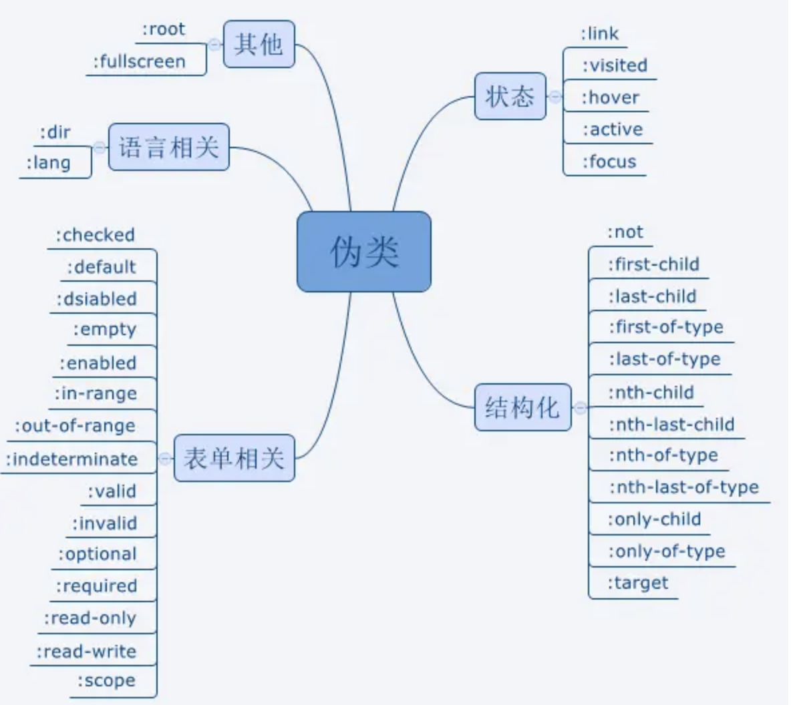

html:

冒泡和捕获

~~~
冒泡指的是：当给某个目标元素绑定了事件之后，这个事件会依次往它的父级元素触发

冒泡阶段：事件从目标元素向根元素反向传播。
捕获阶段：事件从根元素开始向目标元素传播。

阻止冒泡
event.stopPropagation()
阻止事件捕获和冒泡
event.stopImmediatePropagation()


事件委托
通过冒泡，将事件绑定到父元素上，从而管理其子元素的事件。这样可以避免对多个子元素逐一绑定事件
~~~


跨域
~~~
跨域是指在浏览器中，由于	同源策略	的限制
协议	域名	端口

解决跨域
前端没法解决跨域，只能绕过
JSONP：利用 <script> 标签没有跨域限制的特点，通过动态创建 <script> 标签实现跨域请求。
只能get

CORS ：服务器通过设置特定的 HTTP 响应头，允许浏览器访问其资源。
Access-Control-Allow-Origin：*

代理服务器	nginx反向代理	websork
~~~


bfc和盒模型

~~~
bfc 块级格式化上下文，
独立的布局区域，其中的子元素不会影响外部元素，外部元素也不会影响内部元素

盒模型：
标准盒模型 内容
（IE）怪异盒模型 内容+p+b
~~~


web worker

~~~
运行在后台的 js，通过postMessage 将结果回传到主线程，进行复杂操作的时候，就不会阻塞主线程了
~~~


css:

css伪类和伪元素有哪些

~~~
:hover：鼠标悬停时。
:active：元素被点击激活时。
:focus：元素获得焦点时。
:visited：访问过的链接。
:link：尚未访问的链接。

::before：在元素内容之前插入内容。
::after：在元素内容之后插入内容。
::first-line：选择元素的第一行文本。
::first-letter：选择元素的第一个字母。
::selection：选择用户选中的内容。
::marker：用于列表项的标记部分。
::placeholder：选择表单元素中的占位符文本。
~~~




px、em、rem

~~~
px 屏幕上的物理像素。
em 基于 父 元素的字体大小
rem 基于根元素（<html>）的字体大小。
~~~


如何画0.5px的线

~~~
transform: scale() 缩放
background: linear-gradient(to bottom, black 50%, transparent 50%)	渐变
svg、canvas

~~~


回流与重绘

~~~
重绘：当渲染树中的元素外观（如：颜色、背景）发生改变，不影响布局时，产生重绘
回流：当渲染树中的元素的布局（如：尺寸、位置、隐藏/状态状态）发生改变时，浏览器重新计算元素的布局，产生重绘回流

回流必将引起重绘，而重绘不一定会引起回流
~~~


js:

cookie和localStorage区别

~~~
cookie会在http请求中携带

存储大小：
cookie 小		localStorage 大

有期时间：
cookie 窗口或浏览器关闭会失效
localStorage 浏览器关闭后数据不丢失
~~~


let和var

~~~
作用域不同
let具有 块级作用域，只能在其所在的代码块（{}）内访问
var具有 函数作用域，如果声明在函数中，则在整个函数中都可以访问。

let会	暂时性死区 ，先用后声明会报错
var会	变量提升 ，先用后声明会undefined

let可以重复声明，var不可以
let不会添加到全局，var会
~~~


new操作符具体干了什么呢?

~~~
创建一个空对象，并且 this 变量引用该对象，同时还继承了该函数的原型
属性和方法被加入到 this 引用的对象中
新创建的对象由 this 所引用，并且最后隐式的返回 this
~~~


http状态码
~~~
2xx:成功返回码
200	ok		201	请求成功并且服务器创建新的资源		202	服务器已接受请求，但尚未处理

3XX：重定向
301永久重定向		302暂时重定向		303暂时重定向

4XX：客户端错误
400服务器无法理解请求的格式		401请求未授权		403禁止访问

5XX: 服务器错误
500服务器爆炸		503服务器无法处理请求
~~~


this和普通函数区别
~~~
不能做构造函数，因为没有自身的this
this指向问题
没有
~~~


vue：

vue的哈希模式和history模式有什么区别

~~~
哈希模式:	#	和后面的字符称之为hash,通过 URL 中的 # 符号来实现路由的跳转,用 window.location.hash 读取，# 后面的部分不会被浏览器发送到服务器，hash不会重加载页面。

history模式：history采用HTML5的新特性；且提供了两个新方法： pushState()， replaceState()可以对浏览器历史记录栈进行修改，以及popState事件的监听到状态变更
~~~


v-if和v-show区别
~~~
v-if 会销毁 和 创建 DOM 元素
v-show  始终渲染 DOM 元素，但通过控制元素的 display 样式来实现显示和隐藏
~~~


双向绑定数据的原理

~~~
采用	数据劫持结合发布者-订阅者模式	的方式，通过Object.defineProperty()来劫持各个属性的setter，getter，在数据变动时发布消息给订阅者，触发相应的监听回调
~~~


nextTick

~~~
在下次dom更新循环结束之后执行延迟回调，可用于获取更新后的dom状态
~~~


data为什么是函数

~~~
每个组件都是 Vue 的实例。
组件共享 data 属性，当 data 的值是同一个引用类型的值时，改变其中一个会影响其他
app是对象，是因为不需要是因为他只创建一次
~~~


computed和watch区别

```
每个 computed 属性都是一个 watch 实例

computed：缓存性，只有在依赖的属性值改变之后，下一次获取computed的值时才会重新计算
watch：可以异步，更多的是「观察」的作用,类似于某些数据的监听回调,用于观察props $emit或者本组件的值,当数据变化时来执行回调进行后续操作
```


v-model双向绑定原理

~~~
v-model在内部就是不同的输入元素，使用绑定不同的属性并抛出不同的事件
<input :value="sth" @input="sth = $event.target.value" /> 
~~~


vue修饰符

~~~
stop：阻止事件的冒泡
prevent：阻止事件的默认行为
once：只触发一次
self：只触发自己的事件行为时，才会执行
~~~


vue2和vue3区别

~~~
响应式
v2:Object.defineProperty	选项式		只能单个根元素
v3:Proxy	组合式		支持多个根元素

~~~


导航守卫

~~~
beforeRouteEnter进入当前组件
beforeRouteUpdate离开当前路由
beforeLeave路由改变，并且复用同一个组件实例时触发。
~~~


小程序生命周期

~~~
onLaunch()	小程序初始化时触发，且只会触发一次。
onShow()	小程序启动或从后台进入前台时触发。
onHide()	小程序从前台进入后台时触发。
onError()	小程序发生错误时触发，可以获取错误信息。
onPageNotFound()	页面不存在时触发。

~~~

